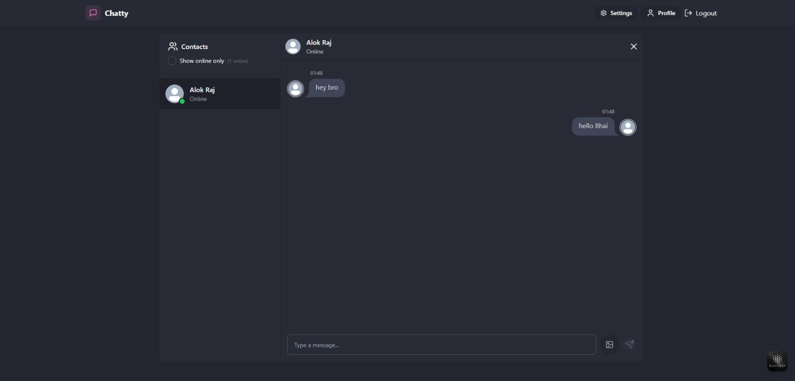
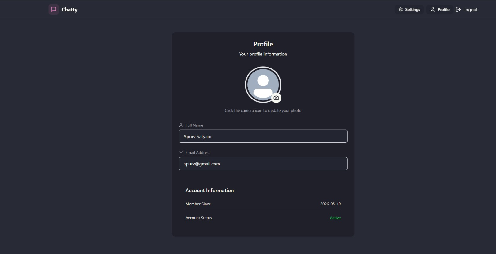
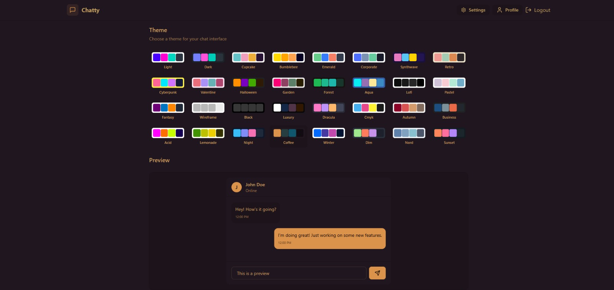

# Connectify 💬

A modern real-time chat application built using the MERN Stack and Socket.io that enables users to communicate instantly with a smooth and responsive interface.

---

## 🚀 Features

✨ Real-time Messaging  
🔐 Secure Authentication & Authorization  
🟢 Online / Offline User Status  
🖼️ Profile Picture Upload  
🎨 Multiple Theme Customization  
⚡ Instant Message Delivery with Socket.io  
📱 Fully Responsive Modern UI  
🔒 JWT-based Authentication System  

---

## 🛠️ Tech Stack

### Frontend
- React.js
- Tailwind CSS
- DaisyUI
- Zustand

### Backend
- Node.js
- Express.js

### Database
- MongoDB

### Real-time Communication
- Socket.io

---

## 📂 Project Structure

```bash
Connectify/
│
├── frontend/
├── backend/
├── screenshots/
└── README.md
```

---

## ⚙️ Installation & Setup

### 1️⃣ Clone the Repository

```bash
git clone https://github.com/imapurvsatyam/Connectify.git
```

---

### 2️⃣ Navigate to Project Folder

```bash
cd Connectify
```

---

### 3️⃣ Install Frontend Dependencies

```bash
cd frontend
npm install
```

---

### 4️⃣ Install Backend Dependencies

```bash
cd ../backend
npm install
```

---

## 🔑 Environment Variables

Create a `.env` file inside the backend folder and add:

```env
MONGODB_URI=mongodb://127.0.0.1:27017/connectify
JWT_SECRET=your_secret_key
PORT=5001
```

---

## ▶️ Run the Project

### Start Backend

```bash
cd backend
npm run dev
```

---

### Start Frontend

Open another terminal:

```bash
cd frontend
npm run dev
```

---

## 🌐 Open in Browser

```bash
http://localhost:5173
```

---

# 📸 Screenshots

## 💬 Chat Interface



---

## 👤 User Profile



---

## 🎨 Theme Customization



---

# 🌟 Key Highlights

- Real-time communication system
- Modern dark-themed UI
- Multiple customizable themes
- Secure JWT authentication
- Profile management system
- Responsive chat interface
- Clean and minimal design

---

# 🔮 Future Improvements

- Group Chats
- Emoji Support
- File Sharing
- Voice & Video Calling
- Message Reactions
- Typing Indicators

---

# 👨‍💻 Author

### Apurv Satyam

GitHub:  
https://github.com/imapurvsatyam

LinkedIn:  
https://www.linkedin.com/www.linkedin.com/in/apurv-satyam-5a72662b8


---

